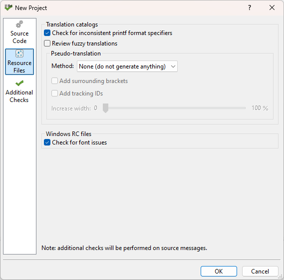
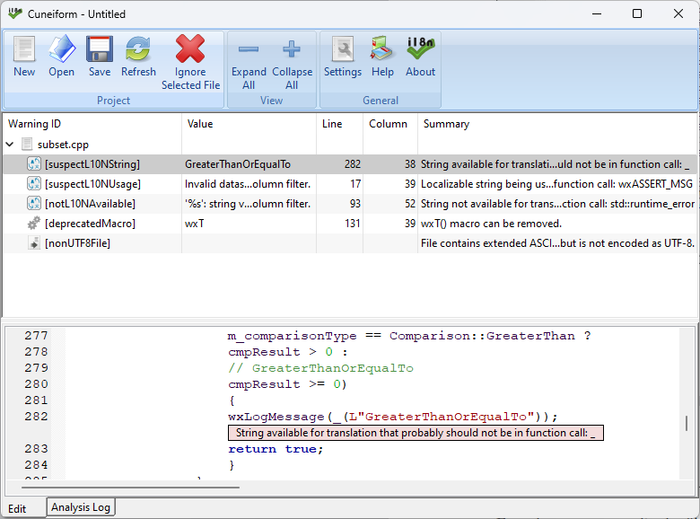

Cuneiform
=============================

<a href="docs/manual/book/cuneiform.pdf"></a>

Internationalization & localization analysis system for C++ code, *gettext* catalogs, and Windows&reg; RC files.

`Cuneiform` is a command-line utility and graphical user interface that scans source and resource files to check for
various i18n and l10n issues.

Additionally, the GUI version provides pseudo-translation support for
*gettext* catalogs (\*.po files).

Refer to the [manual](docs/manual/book/cuneiform.pdf) for full documentation.

## File Support

`Cuneiform` supports static analysis for the following:

- C code
- C++ code ('98 and modern C++)
- Windows resource files (\*.rc)

Static analysis and pseudo-translation are available for:

- GNU *gettext* translation files (\*.po)

Additionally, it offers specialized support for the following frameworks:

- wxWidgets
- Qt
- KDE
- GTK+
- Win32
- MFC

¹ Strings are considered translatable if inside of [gettext](https://www.gnu.org/software/gettext/),
[wxWidgets](https://www.wxwidgets.org), [Qt](https://www.qt.io), or
[KDE](https://develop.kde.org/docs/plasma/widget/translations-i18n) (ki18n) i18n functions.
This includes functions and macros such as `gettext()`, `_()`, `tr()`, `translate()`,
`QT_TR_NOOP()`, `wxTRANSLATE()`, `i18n()`, etc.<br />
² Variables are determined to be ID variables if they are integral types with the whole word "ID" in their name.

Refer [here](Example.md) for example usage.

## Static Analysis


The command line and GUI versions provide the following checks:

- Strings exposed for translation¹ that probably should not be. This includes (but not limited to):
  - Filenames
  - Strings only containing `printf()` commands
  - Numbers
  - Regular expressions
  - Strings inside of debug functions
  - Formulas
  - Code (used for code generators)
  - Strings that contain URLs or email addresses
- Strings not available for translation that possibly should be.
- Strings that contain extended ASCII characters that are not encoded.
  ("Danke schön" instead of "Danke sch\U000000F6n".)<br />
  Encoding extended ASCII characters is recommended for
  best portability between compilers.
- Strings with malformed syntax (e.g., malformed HTML tags).
- Use of deprecated text macros (e.g., `wxT()` in wxWidgets, `_T()` in Win32).
- Use of deprecated string functions (e.g., `_tcsncpy()` in Win32).
- Files that contain extended ASCII characters, but are not UTF-8 encoded.<br />
  (It is recommended that files be UTF-8 encoded for portability between compilers.)
- UTF-8 encoded files which start with a BOM/UTF-8 signature.<br />
  It is recommended to save without the file signature for best compiler portability.
- `printf()`-like functions being used to just format an integer to a string.<br />
  It is recommended to use `std::to_string()` to do this instead.
- `printf()` command mismatches between source and translation strings.<br />
  (PO catalogs with C/C++ strings are currently supported.)
- Font issues in Windows resource files:
  - Dialogs not using "MS Shell Dlg" or "MS Shell Dlg 2."
  - Dialogs with non-standard font sizes.

Code formatting and other issues can also be checked for, such as:
- Trailing spaces at the end of a line.
- Tabs (instead of spaces).
- Lines longer than 120 characters.
- Spaces missing between "//" and their comments.
- ID variable² assignment issues:
  - The same value being assigned to different ID variables in the same source file
    (e.g., "wxID_HIGHEST + 1" being assigned to two menu ID constants).
  - Hard-coded numbers being assigned to ID variables.
  - Out-of-range values being assigned to MFC IDs.

## Pseudo-translation

(available in the GUI version)



Pseudo-translation includes features such as:
- Multiple methods for character replacement (e.g., replacing characters with accented variations or upper casing them).
- Increasing the width of the translations. This is useful for ensuring that strings are not being truncated at runtime.
- Wrapping the translations in braces. This is useful for ensuring that strings are not being pieced together at runtime.
- Appending a unique ID to each translation. This is useful for finding where a translation is being loaded from.

When pseudo-translating, a copy of all *gettext* \*.po and \*.pot files will be created and have their translations filled
with mutations of the respective source strings. These files (which will have a "pseudo_" prefix) can then be compiled into \*.mo files and
loaded by your application for integration testing.

[](https://github.com/Blake-Madden/Cuneiform/actions/workflows/linux-build.yml)
[](https://github.com/Blake-Madden/Cuneiform/actions/workflows/macOS%20build.yml)
[](https://github.com/Blake-Madden/Cuneiform/actions/workflows/msw-build.yml)

[](https://github.com/Blake-Madden/Cuneiform/actions/workflows/unit-tests.yml)
[](https://github.com/Blake-Madden/Cuneiform/actions/workflows/macos-unit-test.yml)
[](https://github.com/Blake-Madden/Cuneiform/actions/workflows/msw-unit-tests.yml)

[](https://github.com/Blake-Madden/Cuneiform/actions/workflows/cppcheck.yml)
[](https://github.com/Blake-Madden/Cuneiform/actions/workflows/codeql.yml)
[](https://github.com/Blake-Madden/Cuneiform/actions/workflows/msvc.yml)

[](https://github.com/Blake-Madden/Cuneiform/actions/workflows/doxygen.yml)
[](https://github.com/Blake-Madden/Cuneiform/actions/workflows/spell-check.yml)
[](https://github.com/Blake-Madden/Cuneiform/actions/workflows/i18n-check.yml)

# Usage

`Cuneiform` accepts the following arguments:

```shellscript
[input]: The folder to analyze.

--enable: Which checks to perform. Can be any combination of:
  allI18N:                Perform all internationalization checks (the default).
  allL10N:                Perform all localization checks (the default).
  allCodeFormatting:      Check all code formatting issues.
                          These are not enabled by default.
  suspectL10NString:      Check for translatable strings that shouldn't be
                          (e.g., numbers, keywords, printf() commands).
  suspectL10NUsage:       Check for translatable strings being used in internal contexts
                          (e.g., debugging functions).
  urlInL10NString:        Check for translatable strings that contain URLs or email addresses.
                          It is recommended to dynamically format these into the string so that
                          translators don't have to manage them.
  spacesAroundL10NString: Check for strings that start or end with spaces.
                          These may be strings that are concatenated at runtime.
  L10NStringNeedsContext: Check for possibly ambiguous strings that lack a translator comment.
  notL10NAvailable:       Check for strings not exposed for translation.
  deprecatedMacro:        Check for deprecated text macros (e.g., wxT()).
  nonUTF8File:            Check that files containing extended ASCII characters are UTF-8 encoded.
  UTF8FileWithBOM:        Check for UTF-8 encoded files which start with a BOM/UTF-8 signature.
                          It is recommended to save without the file signature for
                          best compiler portability.
  unencodedExtASCII:      Check for strings containing extended ASCII characters that are not encoded.
  printfSingleNumber:     Check for printf()-like functions being used to just format a number.
  dupValAssignedToIds:    Check for the same value being assigned to different ID variables.
  numberAssignedToId:     Check for ID variables being assigned a hard-coded number.
                          It may be preferred to assign framework-defined constants to IDs.
  malformedString:        Check for malformed syntax in strings (e.g., malformed HTML tags).
  fontIssue:              Check for font issues (e.g., Windows *.RC dialogs not using MS Shell Dlg
                          or using unusual font sizes).
  trailingSpaces:         Check for trailing spaces at the end of each line.
                          This is a code formatting check and is not enabled by default.
  tabs:                   Check for tabs.
                          (Spaces are recommended as tabs may appear differently between editors.)
                          This is a code formatting check and is not enabled by default.
  wideLine:               Check for overly long lines.
                          This is a code formatting check and is not enabled by default.
  commentMissingSpace:    Check that there is a space at the start of a comment.
                          This is a code formatting check and is not enabled by default.
  printfMismatch:         Check for mismatching printf() commands between source and translation strings.
  acceleratorMismatch:    Check for mismatching keyboard accelerators between source and translation strings.
  transInconsistency:     Check for inconsistent trailing punctuation, spaces, or newlines.

--disable: Which checks to not perform. (Refer to options available above.)
           This will override any options passed to "--enable".

--log-l10n-allowed: Whether it is acceptable to pass translatable strings to 
                    logging functions. Setting this to false will emit warnings
                    when a translatable string is passed to functions such as
                    wxLogMessage or SDL_Log.
                    (Default is true.)

--punct-l10n-allowed: Whether it is acceptable for punctuation only strings to be
                      translatable. Setting this to true will suppress warnings about
                      strings such as " - " being available for localization.
                      (Default is false.)

--exceptions-l10n-required: Whether to verify that exception messages are available
                            for translation. Setting this to true will emit warnings
                            when untranslatable strings are passed to various exception
                            constructors or functions (e.g., AfxThrowOleDispatchException).
                            (Default is true.)

--min-l10n-wordcount: The minimum number of words that a string must have to be
                      considered translatable. Higher values for this will result in less
                      strings being classified as a notL10NAvailable warning.
                      (Default is 2.)

--fuzzy:              Whether to review fuzzy translations.
                      (Default is false.)

--cpp-version: The C++ standard that should be assumed when issuing deprecated macro warnings.
               (Default is 2014.)

-i,--ignore: Folders and files to ignore (can be used multiple times).

-o,--output: The output report path (tab-delimited or CSV format).
             (Can either be a full path, or a file name within the current working directory.)

-q,--quiet: Only print errors and the final output.

-v,--verbose: Display debug information.

-h,--help: Print usage.
```

The following example will analyze the folder "c:\src\wxWidgets\src"
(but ignore the subfolders "expat" and "zlib"). It will only check for
suspect translatable strings, and then send the output to "results.txt"
in the current working directory. 

```shellscript
cuneiform C:\src\wxWidgets\src -i expat -i zlib --enable=suspectL10NString -o results.txt
```

This example will only check for `suspectL10NUsage` and `suspectL10NString` and not show
any progress messages.

```shellscript
cuneiform C:\src\wxWidgets\samples -q --enable=suspectL10NUsage,suspectL10NString
```

This example will ignore multiple folders (and files) and output the results to "WDVResults.txt."

```shellscript
cuneiform C:\src\Wisteria-dataviz\src --ignore=import,wxsimplejson,wxStartPage,math,easyexif,debug,utfcpp,CRCpp,base/colors.cpp,base/colors.h -o WDVresults.txt
```

Refer [here](Example.md) for more examples.

# Building (command line tool)

`Cuneiform` can be configured and built with *Cmake*.

On Unix:

```shellscript
cmake . -DCMAKE_BUILD_TYPE=Release
cmake --build . --target all -j $(nproc) --config Release
```

On Windows, "CMakeLists.txt" can be opened and built directly in Visual Studio.

After building, "cuneiform" will be available in the "bin" folder.

# Building (GUI)



[wxWidgets](https://github.com/wxWidgets/wxWidgets) 3.2 or higher is required for building the graphical user interface version.

Download [wxWidgets](https://github.com/wxWidgets/wxWidgets), placing it at the same folder level as this project.
After building wxWidgets, *Cuneiform* can be configured and built with *Cmake*.

On Unix:

```shellscript
cd ..
git clone https://github.com/wxWidgets/wxWidgets.git --recurse-submodules
cd wxWidgets
cmake . -DCMAKE_INSTALL_PREFIX=./wxlib -DwxBUILD_SHARED=OFF \
      -D"CMAKE_OSX_ARCHITECTURES:STRING=arm64;x86_64" -DCMAKE_BUILD_TYPE=Release
cmake --build . --target install -j $(nproc) --config Release
cd ..
cd Cuneiform/gui
cmake . -DCMAKE_BUILD_TYPE=Release
cmake --build . --target all -j $(nproc) --config Release
```

On Windows with Visual Studio, build wxWidgets with the defaults, except `wxBUILD_SHARED` should be set to "OFF"
(and `MAKE_BUILD_TYPE` set to "Release" for release builds).

Open "gui/CMakeLists.txt" in Visual Studio, setting the *CMake* setting's configuration type to "Release" for a release build.

After building, "cuneiform" will be available in the "bin" folder.

# GitHub Action

You can also create a `Cuneiform` GitHub action to make it part of your CI.
For example, create a new workflow called "cuneiform.yml" and enter the following:

```shellscript
name: Cuneiform
on: [push]

jobs:
  build:
    name: Cuneiform
    runs-on: ubuntu-latest
    steps:
      - uses: actions/checkout@v3

      - name: install Cuneiform
        run: |
             git clone https://github.com/Blake-Madden/Cuneiform.git --recurse-submodules
             cd Cuneiform
             cmake ./
             make -j4
             cd ..

      - name: analyze
        run: |
             # Ignore Cuneiform's own folder.
             # You can ignore other folders by adding a comma and the folder name
             # after "--ignore=Cuneiform".
             ./Cuneiform/bin/cuneiform ./ --ignore=Cuneiform -q -o i18nresults.txt

      - name: review results
        run: |
             REPORTFILE=./i18nresults.txt
             WARNINGSFILE=./warnings.txt
             if test -f "$REPORTFILE"; then
                cat "$REPORTFILE" > "$WARNINGSFILE"
                # are there any warnings?
                if grep -qP '\[[a-zA-Z0-9]+\]' "$WARNINGSFILE"; then
                    # print the remaining warnings
                    echo Warnings detected:
                    echo ==================
                    cat "$WARNINGSFILE" | grep -P '\[[a-zA-Z0-9]+\]'
                    # fail the job
                    exit 1
                else
                    echo No issues detected
                fi
             else
                echo "$REPORTFILE" not found
             fi
```
